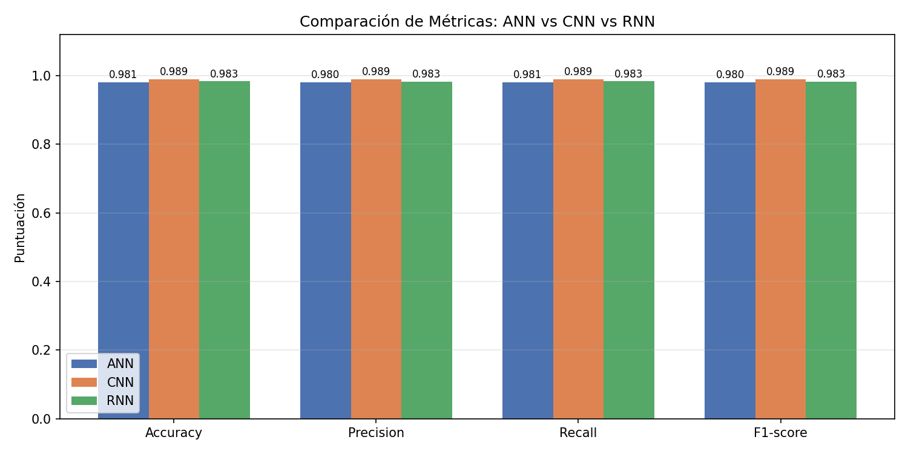
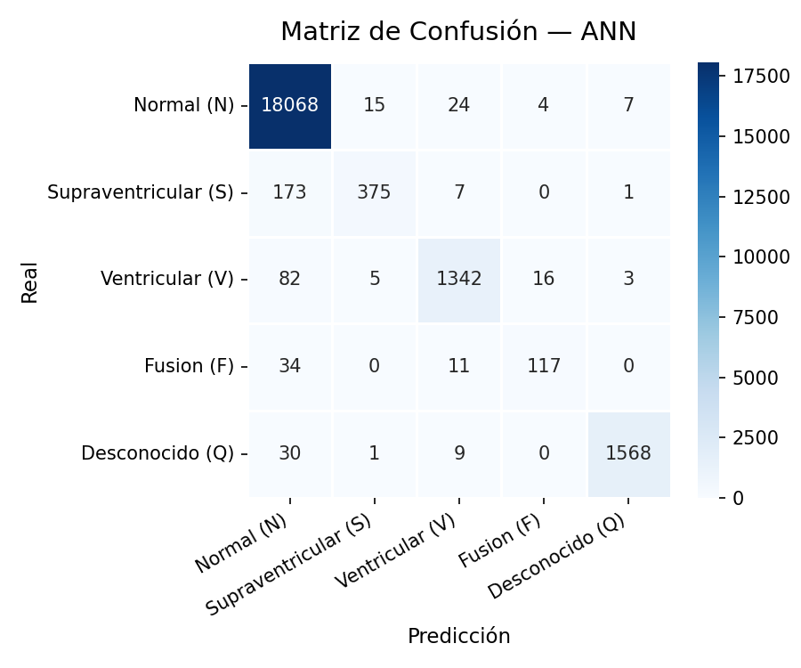
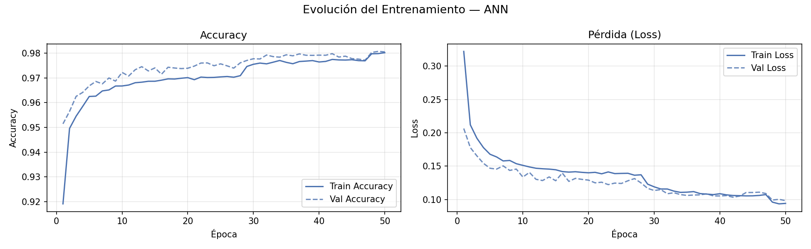
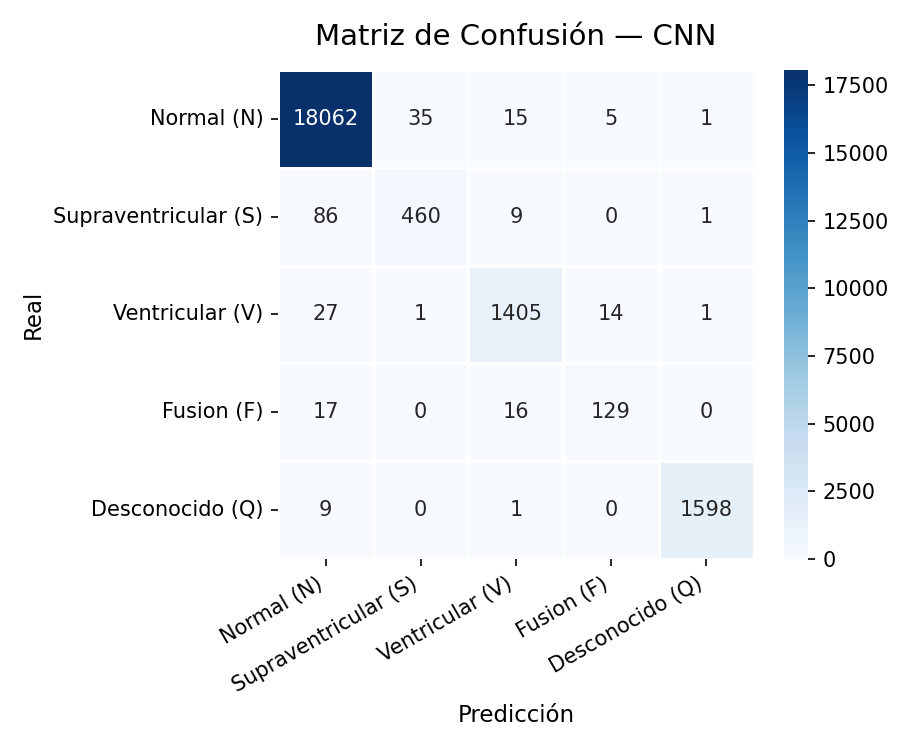
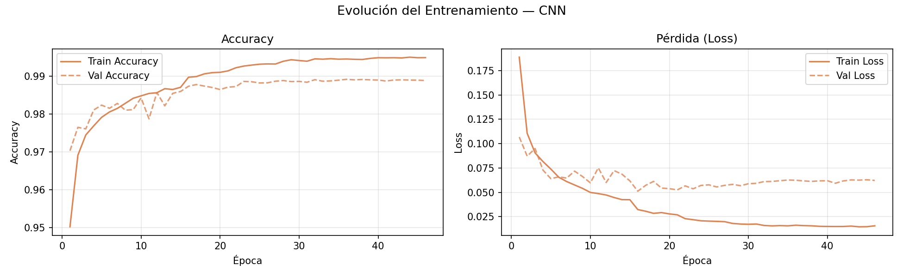
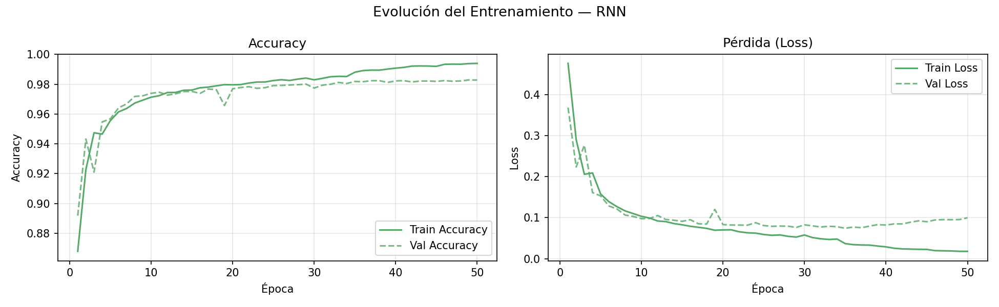

# Proyecto de Clasificación de Ritmos Cardíacos con Redes Neuronales

Este proyecto implementa y compara tres tipos de redes neuronales (ANN, CNN y RNN-LSTM) para la clasificación de ritmos cardíacos utilizando el dataset MIT-BIH. A continuación, se describen los pasos principales y los resultados obtenidos.

## Descripción del Proyecto

El objetivo principal es entrenar modelos de redes neuronales para clasificar señales de ECG en cinco categorías:
- **Normal (N)**
- **Supraventricular (S)**
- **Ventricular (V)**
- **Fusión (F)**
- **Desconocido (Q)**

Se utilizan tres arquitecturas de redes neuronales:
1. **ANN (Artificial Neural Network)**
2. **CNN (Convolutional Neural Network)**
3. **RNN-LSTM (Recurrent Neural Network con LSTM)**

## Resultados

### Comparación de Modelos

La siguiente gráfica muestra la comparación de las métricas de los tres modelos:



### Resultados por Modelo

#### ANN (Red Neuronal Artificial)
- **Matriz de Confusión:**



- **Evolución del Entrenamiento:**



#### CNN (Red Neuronal Convolucional)
- **Matriz de Confusión:**



- **Evolución del Entrenamiento:**



#### RNN-LSTM (Red Neuronal Recurrente)
- **Matriz de Confusión:**


- **Evolución del Entrenamiento:**



## Requisitos

- Python 3.13
- Librerías necesarias:
  - `tensorflow`
  - `numpy`
  - `pandas`
  - `matplotlib`
  - `seaborn`
  - `scikit-learn`

## Ejecución

1. Clonar el repositorio o descargar los archivos.
2. Instalar las dependencias necesarias.
3. Ejecutar el script principal:

```bash
python zProFinalSSPIA2.py
```

## Notas

- Los resultados se guardan automáticamente en la carpeta `resultados`.
- El modelo con mejor desempeño se destaca en la comparación final.

